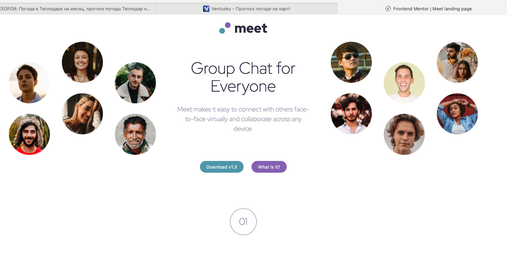

# Frontend Mentor – Meet Landing Page Solution

This is my solution to the [Meet landing page challenge](https://www.frontendmentor.io/challenges/meet-landing-page-UXgHvUQjr) on Frontend Mentor.

## 📸 Screenshot

## 🔗 Live Site

[Visit the live site](https://bruchno.github.io/meet-landing-page/)  
[View the GitHub repository](https://github.com/Bruchno/meet-landing-page)

## 🛠️ Built With

- Semantic HTML5 markup  
- CSS Flexbox for alignment  
- CSS Grid for section layout  
- Cross-browser styling for `border-radius`  
- Mobile-first workflow  
- No use of `opacity` or similar visual effects in this version

## 🌐 Browser Compatibility

Tested and verified in:
- Chrome
- Firefox
- Safari

## 📚 What I Learned

This project helped me practice combining Flexbox and Grid for layout structure and refine cross-browser styling techniques. I focused on clean markup and layout consistency across different screen sizes and browsers.

## 🚧 Continued Development

I plan to explore more advanced visual effects and accessibility improvements in future challenges.

## 👩‍💻 Author

- GitHub – [Bruchno](https://github.com/Bruchno)

## 📝 Acknowledgments

Thanks to Frontend Mentor for the challenge and to everyone who provides constructive feedback.
